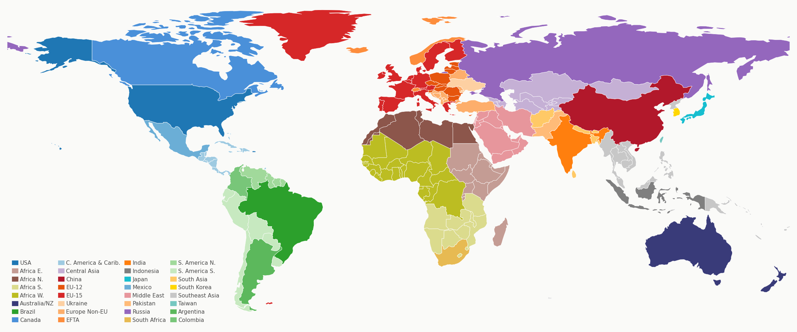

# Resolution Design

## Overview

Temporal and spatial resolution are **user-configurable**. This document defines the defaults and the configuration interface.

---

## 1. Temporal Resolution

### Structure

**Historical** (calibrated): `2000 → 2005 → 2010 → 2015 → 2021` (fixed)

**Bridge**: `2021 → 2025` (fixed, 4yr)

**Projection** (solved): `2025 → 2030 → 2035 → ... → 2150` (user-configurable `dt`, default 5yr)

| Parameter | Default | Configurable | Description |
|-----------|---------|:---:|-------------|
| `HIST_YEARS` | `[2000, 2005, 2010, 2015, 2021]` | No | Fixed historical calibration years |
| `BASE_YEAR` | `2021` | No | Final calibration year; anchor for all initialization |
| `FIRST_PROJ_YEAR` | `2025` | No | First endogenously solved period (always 2025) |
| `TIMESTEP` | `5` | **Yes** | Projection timestep in years (applies from 2025 onward) |
| `END_YEAR` | `2150` | **Yes** | Final model year |

### Why 2021 as Base Year

- Latest year with complete IEA World Energy Balances
- Avoids 2020 COVID distortion
- Pre-2022 energy crisis (Ukraine) — cleaner calibration baseline
- SSP database (2024 release) provides 2021 reference

### Period Generation

```python
HIST_YEARS = [2000, 2005, 2010, 2015, 2021]  # fixed, not configurable
FIRST_PROJ_YEAR = 2025                        # fixed, not configurable

def build_periods(timestep=5, end_year=2150):
    """Generate model period sequence.

    2000–2021: fixed historical calibration years.
    2021–2025: fixed bridge (always 4 yr, not configurable).
    2025 onward: uniform steps of `timestep` years.
    """
    proj_years = list(range(FIRST_PROJ_YEAR, end_year + 1, timestep))
    if proj_years[-1] != end_year:
        proj_years.append(end_year)
    return HIST_YEARS + proj_years
```

**Default** (`timestep=5`): `[2000, 2005, 2010, 2015, 2021, 2025, 2030, 2035, ..., 2150]`

**Annual** (`timestep=1`): `[2000, 2005, 2010, 2015, 2021, 2025, 2026, 2027, ..., 2150]`

**Decadal** (`timestep=10`): `[2000, 2005, 2010, 2015, 2021, 2025, 2035, 2045, ..., 2145, 2150]`

### Variable Δt

All accumulation equations **must** use period-specific Δt:

```python
dt = periods[i+1] - periods[i]  # NOT a constant

# Capital accumulation
K_next = (1 - delta)**dt * K + I_K * dt

# Vintage aging: survival evaluated at actual elapsed years
# Learning: cumulative deployment accumulated over actual dt
# Emissions stock: flow × dt
```

**Never** hardcode `dt = 5`. The bridge periods (2015→2021 = 6yr, 2021→2025 = 4yr) and user-configurable timesteps require variable Δt throughout.

---

## 2. Spatial Resolution

### Default: 32 Regions



| ID | Region | ID | Region |
|----|--------|----|--------|
| 1 | USA | 17 | India |
| 2 | Africa_Eastern | 18 | Indonesia |
| 3 | Africa_Northern | 19 | Japan |
| 4 | Africa_Southern | 20 | Mexico |
| 5 | Africa_Western | 21 | Middle East |
| 6 | Australia_NZ | 22 | Pakistan |
| 7 | Brazil | 23 | Russia |
| 8 | Canada | 24 | South Africa |
| 9 | Central America and Caribbean | 25 | South America_Northern |
| 10 | Central Asia | 26 | South America_Southern |
| 11 | China | 27 | South Asia |
| 12 | EU-12 | 28 | South Korea |
| 13 | EU-15 | 29 | Southeast Asia |
| 14 | Ukraine | 30 | Taiwan |
| 15 | Europe_Non_EU | 31 | Argentina |
| 16 | European Free Trade Association | 32 | Colombia |

### Mapping Files

**Default mapping** (shipped with GHIM):

| File | Path | Content |
|------|------|---------|
| Region names | `ghim/data/external/common/GCAM_region_names.csv` | `GCAM_region_ID` → `region` name |
| ISO mapping | `ghim/data/external/common/iso_GCAM_regID.csv` | `iso` → `country_name` → `GCAM_region_ID` |

Format of `GCAM_region_names.csv`:
```csv
GCAM_region_ID,region
1,USA
2,Africa_Eastern
...
32,Colombia
```

Format of `iso_GCAM_regID.csv`:
```csv
iso,country_name,region_GCAM3,GCAM_region_ID
usa,United States,USA,1
chn,China,China,11
...
```

### User-Provided Region Mapping

Users can supply a custom mapping file via configuration:

```python
# config or CLI
region_mapping_file = "path/to/custom_regions.csv"
```

**Required format** — same as `GCAM_region_names.csv`:
```csv
region_id,region
1,East_Asia
2,South_Asia
...
```

Plus a corresponding ISO mapping file:
```csv
iso,country_name,region_id
chn,China,1
jpn,Japan,1
ind,India,2
...
```

When a custom mapping is provided:
- All data aggregation (IEA, SSP, supply curves) uses the custom mapping
- Region count is inferred from the file (no hardcoded `N_REGIONS`)
- State vector dimension adjusts automatically: `4 × N_REGIONS + 5`

---

## 3. Phase Defaults

The framework is flexible, but each phase has a concrete default configuration:

### Phase 1

| | Setting |
|---|---------|
| **Time** | 2000–2150, 5-year projection steps (`timestep=5`) |
| **Periods** | `[2000, 2005, 2010, 2015, 2021, 2025, 2030, ..., 2150]` (28 periods) |
| **Regions** | GCAM 32 (default mapping) |
| **Data** | IEA energy balances aggregated to R32; SSP at R32; GCAM supply curves at R32 |

### Phase 2+

| | Setting |
|---|---------|
| **Time** | 2000–2150, annual projection steps (`timestep=1`) |
| **Periods** | `[2000, 2005, 2010, 2015, 2021, 2025, 2026, 2027, ..., 2150]` (131 periods) |
| **Regions** | 100+ ISO countries (user-provided mapping) |
| **Data** | Country-level IEA balances; SSP country projections; supply curves downscaled by GDP share |

### What Changes Between Phases

| Aspect | Phase 1 → Phase 2+ |
|--------|-------------------|
| Timestep | `5` → `1` (config change) |
| Region file | default GCAM 32 → custom ISO countries (config change) |
| Data pipeline | R32 aggregation → country-level (new data files) |
| **Code** | **No structural change** — same `build_periods()`, same `ResolutionConfig` |

The entire Phase 1 → Phase 2+ transition is a **configuration change**, not a code change. This is by design.

